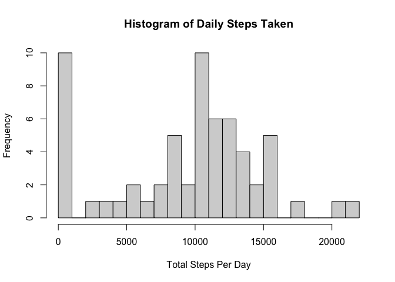
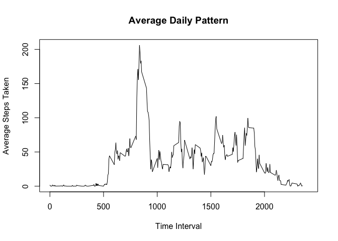
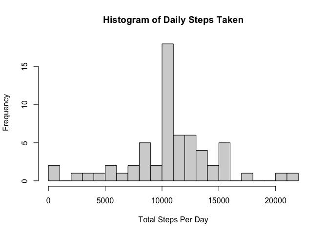
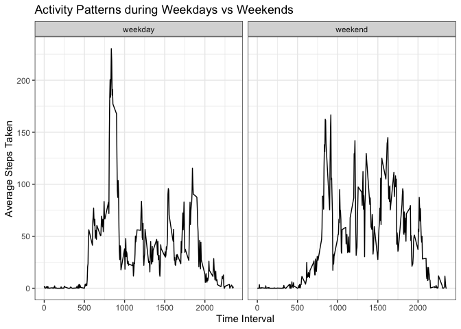

## Loading and preprocessing the data  
\
We first load useful packages...


```r
library(dplyr)
```

```
## 
## Attaching package: 'dplyr'
```

```
## The following objects are masked from 'package:stats':
## 
##     filter, lag
```

```
## The following objects are masked from 'package:base':
## 
##     intersect, setdiff, setequal, union
```

```r
library(ggplot2)
```

... then load and preprocess the data. 
At this point, we'll just convert the date variable. 


```r
unzip("activity.zip")
data <- read.csv("activity.csv")
data <- data %>% mutate(date = as.Date(date, "%Y-%m-%d"))
```
\
\

## What is mean total number of steps taken per day?  

Let's now calculate how many steps are taken per day, and plot a histogram 
with nice breaks...


```r
data_daily <- data %>% group_by(date) %>% 
    summarise(daily_steps = sum(steps, na.rm = T))

range <- seq(0, max(data_daily$daily_steps, na.rm = T)+1000, 1000)

hist(data_daily$daily_steps,
     breaks = range,
     main = "Histogram of Daily Steps Taken",
     xlab = "Total Steps Per Day")
```

<!-- -->


```r
mean <- as.integer(mean(data_daily$daily_steps, na.rm = T))
median <- as.integer(median(data_daily$daily_steps, na.rm = T))
```

Per day, the mean steps taken is **9354** and median is **10395**.  
\
\

## What is the average daily activity pattern?

Now, let's calculate and plot the average steps taken per 5-minute intervals... 

```r
data_interval <- data %>% group_by(interval) %>% 
    summarise(interval_steps = mean(steps, na.rm = T))

with(data_interval, plot(interval, interval_steps, type = "l",
     ylab = "Average Steps Taken", xlab = "Time Interval",
     xlim = c(0, 2400),
     main = "Average Daily Pattern"))
```

<!-- -->

Based on the plot, steps spiked up in the morning.. 


```r
max_interval <- data_interval$interval[which.max(data_interval$interval_steps)]
```

On average, the most number of steps taken is during **835** AM.  
\
\

## Imputing missing values

Now let's deal with the NAs in our dataset...

How many rows with NAs do we have? 

```r
sum(!complete.cases(data))
```

```
## [1] 2304
```

Let's impute for these missing values using the mean steps for that interval


```r
datafilled <- data %>% left_join(data_interval) %>%
    mutate(steps = ifelse(is.na(steps) == T, interval_steps, steps))
```

```
## Joining, by = "interval"
```
\
Now let's recalculate the daily histogram... 


```r
data_daily2 <- datafilled %>% group_by(date) %>% 
    summarise(daily_steps = sum(steps, na.rm = T))

range2 <- seq(0, max(data_daily2$daily_steps, na.rm = T)+1000, 1000)

hist(data_daily2$daily_steps,
     breaks = range2,
     main = "Histogram of Daily Steps Taken",
     xlab = "Total Steps Per Day")
```

<!-- -->


```r
mean2 <- as.integer(mean(data_daily2$daily_steps, na.rm = T))
median2 <- as.integer(median(data_daily2$daily_steps, na.rm = T))
```

Per day, the mean steps taken is **10766** and median is **10766**.  
Now, the estimates are slightly higher than using the dataset with missing values. 
There are now a lot less days with zero to few steps. 

\
\


## Are there differences in activity patterns between weekdays and weekends?

Let's tag whether days are weekends or weekdays... 

```r
datafilled <- datafilled %>% 
    mutate(day = factor(ifelse(weekdays(date) %in% c("Saturday", "Sunday"), 
                        "weekend", "weekday")))
```

Now let's calculate mean steps per interval during weekdays vs weekends...

```r
interval_day <- datafilled %>% group_by(interval, day) %>%
    summarise(interval_steps = mean(steps, na.rm = T))
```

```
## `summarise()` has grouped output by 'interval'. You can override using the `.groups` argument.
```

```r
qplot(data = interval_day, y = interval_steps, x = interval, 
      geom = "line", facets = . ~ day, 
      xlab = "Time Interval", 
      ylab = "Average Steps Taken",
      main = "Activity Patterns during Weekdays vs Weekends") + 
    theme_bw()
```

<!-- -->

On weekdays, most steps are taken during the morning (presumably on the way
to work) then stabilizes until the evening (going home from work?). 
\
On weekends, steps are taken a bit later and with more steps in the afternoon. 


